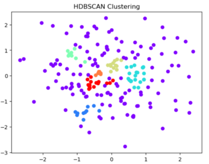

# YouTube Comment Sentiment Analysis Chrome Extension (Advanced Clustering Branch)

## Overview & Key Advancements

This branch of the YouTube Comment Sentiment Analysis Chrome Extension represents a significant upgrade in its analytical capabilities. While maintaining its core function of helping users understand collective sentiment and key discussion points, this version introduces **advanced clustering techniques** and **improved data visualization**.

**What's new in this branch:**

* **Next-Gen Clustering with HDBSCAN & UMAP:** We've moved beyond simplified K-Means. This version now employs **HDBSCAN** (Hierarchical Density-Based Spatial Clustering of Applications with Noise) for more robust and accurate topic detection. This is coupled with **UMAP** for powerful dimensionality reduction, which preprocesses comment embeddings to 10 components. This combination allows for:
    * Discovery of clusters with varying shapes and densities.
    * Automatic determination of the optimal number of clusters (no more guessing `k`).
    * Explicit handling and identification of "noise" comments that don't fit into any dense cluster.
    * The entire clustering pipeline (UMAP + HDBSCAN) has been moved to the **Flask backend (`my_llm_backend/app.py`)**, leveraging Python's rich data science ecosystem for more efficient and scalable processing.

    **Visualizing the Clustering Difference:**
    To illustrate the power of HDBSCAN over traditional K-Means, consider how each algorithm handles complex data:

    * **Traditional K-Means (Spherical Clusters):**
        Based on empirical evidence, K-means is probably the most popular clustering algorithm. The algorithm itself is relatively simple: Starting with a pre-specified number of cluster centers (which can be distributed randomly or smartly (see `kmeans++`)), each point is initially assigned to its nearest center. In the next step, for each segment, the centers are moved to the centroid of the clustered points. The points are then reassigned to their nearest center. The process is repeated until moving the centers derives little or no improvement (measured by the within cluster sum of squares - the total squared distance between each point and its cluster center).
        K-means performs quite well on datasets where clusters are globular (essentially spherical). However, it struggles and can underperform with clusters of different sizes, densities, or non-spherical shapes, as its underlying assumption is that clusters are roughly uniform and spherical.
        


    * **Advanced HDBSCAN with UMAP (Complex Data & Noise Handling):**
        
     

* **Enhanced Chart.js Integration:** The extension now features a more robust and reliable display of sentiment distribution through **Chart.js**. We've implemented dynamic loading, proper destruction of previous chart instances, and rigorous availability checks to ensure the sentiment pie chart renders consistently and without conflicts.

**WIP Notice:** This extension is currently a **Work in Progress (WIP)** and is under active development. Our goal is to evolve this into a fully-featured Chrome Extension with enhanced capabilities.

## Features

* **Comment Fetching:** Automatically retrieves top-level comments from any YouTube video using the YouTube Data API.
* **AI-Powered Sentiment Analysis:** Utilizes Google Gemini to determine the sentiment (Positive, Negative, Neutral) of individual discussion clusters.
* **Discussion Point Summarization:** Gemini AI generates concise summaries for each identified discussion point, capturing the main collective sentiment and ideas.
* **Advanced Comment Clustering (HDBSCAN & UMAP):** As detailed above, comments are grouped into coherent discussion points using a sophisticated, density-based approach that adapts to the data's natural structure.
* **Overall Sentiment Breakdown:** Provides a quick overview of the total positive, negative, and neutral comments analyzed.
* **Interactive UI Overlay:** Displays analysis results directly on the YouTube video page in a clear, interactive overlay, now with improved chart rendering.
* **Dark Mode Toggle:** User-friendly dark mode option for comfortable viewing.
* **Persistent Preferences:** Saves dark mode preference using Chrome's local storage.

## How it Works

1.  **Comment Retrieval:** When activated on a YouTube video page, the extension fetches top-level comments using the YouTube Data API.
2.  **Embedding Generation:** Each fetched comment is sent to a Flask backend, which uses Google Gemini's `embedding-001` model to generate a numerical vector (embedding) representing its semantic meaning.
3.  **Advanced Clustering & Dimensionality Reduction (Backend Process):** Comments and their embeddings are then processed by the backend Python server (`my_llm_backend/app.py`). Here's the advanced pipeline:
    * **UMAP Reduction:** The high-dimensional embeddings are first reduced to a more manageable 10 components using UMAP. This step helps in distilling the most important features for clustering.
        
    * **HDBSCAN Clustering:** The reduced embeddings are then fed into HDBSCAN, which identifies core clusters, sub-clusters, and noise points based on data density.
        
    * This refined clustering provides more nuanced and accurate topic identification.*
4.  **Sentiment and Summary Analysis:** For each identified cluster (excluding noise points), a representative set of comments is sent to the Flask backend. The backend uses Google Gemini's `gemini-1.5-flash` model to analyze these comments, determine the overall sentiment (Positive, Negative, Neutral) of the cluster, and generate a concise summary.
5.  **Display Results:** The analyzed data, including overall sentiment counts and detailed discussion points with their sentiments and summaries, is displayed in an overlay on the YouTube page. The Chart.js library is now dynamically loaded into the page's head to ensure charts render correctly, destroying any previous instances to prevent conflicts and memory issues.

## Setup and Installation

To get this extension running, you need to set up both the Flask backend and the Chrome extension.

### Prerequisites

* **Python 3.8+**
* **Node.js (for npm/yarn, though not strictly required for this project if you manually manage files)**
* **Google Cloud Project & API Keys:**
    * **Google Gemini API Key:** For text analysis and embeddings. Enable the Gemini API in your Google Cloud Project.
    * **YouTube Data API v3 Key:** For fetching YouTube comments. Enable the YouTube Data API v3 in your Google Cloud Project.

### Part 1: Backend Setup (Flask Application)

1.  **Clone the repository (or create the files):**
    If you haven't already, ensure you have a directory for your backend, e.g., `my_llm_backend`.

2.  **Create a Virtual Environment (Recommended):**
    ```bash
    python -m venv venv
    source venv/bin/activate  # On Windows: venv\Scripts\activate
    ```

3.  **Install Dependencies:**
    ```bash
    pip install Flask google-generativeai python-dotenv Flask-Cors requests umap-learn hdbscan scikit-learn
    ```
    *(Note: `umap-learn`, `hdbscan`, `scikit-learn` are new essential dependencies for the advanced clustering)*

4.  **Create a `.env` file:**
    In the `my_llm_backend` directory (where your `app.py` is located), create a file named `.env` and add your API keys:
    ```
    GOOGLE_API_KEY="YOUR_GEMINI_API_KEY_HERE"
    YOUTUBE_API_KEY="YOUR_YOUTUBE_DATA_API_KEY_HERE"
    ```
    Replace `"YOUR_GEMINI_API_KEY_HERE"` and `"YOUR_YOUTUBE_DATA_API_KEY_HERE"` with your actual API keys.

5.  **Run the Flask Backend:**
    ```bash
    python app.py
    ```
    The backend server will start on `http://127.0.0.1:5000`. Keep this terminal window open and running while using the extension.

### Part 2: Chrome Extension Setup

1.  **Locate Extension Files:**
    Ensure you have the `youtube-sentiment-extension` directory containing:
    * `manifest.json`
    * `content.js`
    * `sentiment_overlay.html`
    * `sentiment_overlay.css`
    * `background.js` (if you have one)
    * `icons/` (if you have them)

2.  **Load the Extension in Chrome:**
    * Open Chrome and navigate to `chrome://extensions/`.
    * Enable **"Developer mode"** by toggling the switch in the top right corner.
    * Click on **"Load unpacked"** in the top left.
    * Select the `youtube-sentiment-extension` directory.

3.  **Pin the Extension (Optional but Recommended):**
    * Click the puzzle piece icon (Extensions) in your Chrome toolbar.
    * Click the pin icon next to "YouTube Comment Sentiment Analysis" to pin it to your toolbar for easy access.

## Usage

1.  **Start the Backend:** Ensure your Flask backend (`app.py`) is running in a terminal.
2.  **Navigate to a YouTube Video:** Go to any YouTube video page in your Chrome browser.
3.  **Activate the Extension:** The extension is designed to automatically inject its UI and start analysis when you land on a YouTube video page.
4.  **View Analysis:**
    * An overlay will appear on the right side of the video.
    * It will show status messages as it fetches comments, gets embeddings, performs clustering, and analyzes sentiment.
    * Once complete, it will display:
        * Overall Sentiment of Key Discussions (Positive, Negative, Neutral counts).
        * A list of "Key Discussion Points," each with its sentiment, a summary, and the number of comments in that point.
        * Clicking "View All Comments in this Point" will expand to show the actual comments contributing to that discussion.
5.  **Close Overlay:** Click the "X" button in the top right of the overlay to close it.

## Troubleshooting

* **"Failed to fetch comments. Check backend server and YouTube API key."**:
    * Ensure your Flask backend (`app.py`) is running and accessible at `http://127.0.0.1:5000`.
    * Verify that your `YOUTUBE_API_KEY` in the `.env` file is correct and has access to the YouTube Data API v3. Check your Google Cloud Project to ensure the API is enabled and quotas are not exceeded.
* **"Internal server error" or "Failed to parse Gemini JSON response"**:
    * Check the terminal where your `app.py` backend is running for detailed error messages.
    * Ensure your `GOOGLE_API_KEY` in the `.env` file is correct and has access to the Gemini API.
    * Sometimes, the LLM might return malformed JSON. The backend has error handling for this, but consistent errors might indicate a deeper issue with the API key or model access.
* **No sentiment colors, or incorrect counts**:
    * Ensure you have the latest versions of `content.js` and `sentiment_overlay.css` as provided in the most recent updates.
    * Perform a **hard refresh** (`Ctrl + Shift + R` or `Cmd + Shift + R`) on the YouTube page after reloading the extension.
    * Verify that the CSS classes `sentiment-positive`, `sentiment-negative`, `sentiment-neutral` are correctly defined in `sentiment_overlay.css` with the desired colors.
* **Extension not appearing on YouTube pages**:
    * Ensure "Developer mode" is enabled on `chrome://extensions/`.
    * Check your `manifest.json` for correct `matches` patterns (`"https://www.youtube.com/watch?v=*"`).
    * Verify that the `window.location.hostname.includes('youtube.com')` check in `content.js` is correct for your specific YouTube environment (it might vary slightly based on regional domains or browser versions). For most cases, `window.location.hostname.includes('youtube.com')` might be a more robust check.

## Future Enhancements

* **Full Extension Integration:** Transition from a basic content script overlay to a more robust, full Chrome Extension architecture with a dedicated popup and background scripting for improved performance and features.
* **Reply Analysis:** Extend comment fetching to include replies and analyze sentiment within threaded discussions.
* **User Customization:** Allow users to adjust clustering parameters or comments analyzed.
* **Performance Improvements:** Optimize API calls and processing for faster analysis.
* **Error Handling UI:** Provide more user-friendly error messages directly in the overlay.
* **Visualizations:** Add more advanced charts or graphs for a more engaging display of sentiment distribution beyond the current pie chart.
* **Custom Prompts:** Allow users to input custom prompts for specialized analysis.

---
